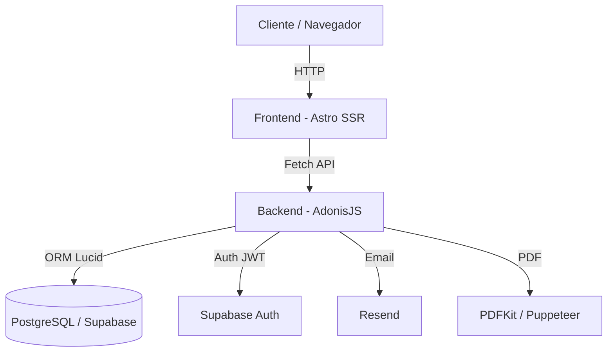

# 🏛️ Club del Meta — Sistema de Gestión

> Sistema completo de gestión de eventos y cotizaciones para el **Club del Meta**. Incluye un sitio web público para clientes, un panel de administración completo y una API REST documentada.

---

## 📋 Contenido

- [Descripción General](#descripción-general)
- [Arquitectura](#arquitectura)
- [Funcionalidades — Frontend](#funcionalidades--frontend)
- [Funcionalidades — Backend](#funcionalidades--backend)
- [Tecnologías](#tecnologías)
- [Estructura del Proyecto](#estructura-del-proyecto)
- [Instalación y Configuración](#instalación-y-configuración)
- [Variables de Entorno](#variables-de-entorno)
- [Scripts Disponibles](#scripts-disponibles)
- [API Reference](#api-reference)
- [Despliegue](#despliegue)
- [Desarrollador](#desarrollador)

---

## Descripción General

El **Club del Meta** es una plataforma web full-stack que permite a los clientes del club solicitar cotizaciones para reservar espacios (salones), mientras que el personal administrativo puede gestionar reservas, controlar pagos, administrar espacios y socios, y consultar reportes analíticos.

El sistema está dividido en dos proyectos independientes:

| Proyecto | Tecnología | Puerto local |
|----------|------------|-------------|
| `frontend/` | Astro 4 (SSR) | `4321` |
| `backend/` | AdonisJS 6 | `3333` |

---

## Arquitectura

```
Club-Management-System/
├── frontend/         # Astro SSR — sitio público + panel admin
└── backend/          # AdonisJS 6 — API REST + lógica de negocio
```



---

## Funcionalidades — Frontend

### 🌐 Sitio Público

#### Página de Inicio (`/`)
- Presentación del club con diseño "Refined Luxury"
- Sección hero con llamada a la acción
- Vista previa de los salones disponibles
- Acceso directo al formulario de cotización

#### Salones (`/salones`)
- Galería visual de todos los espacios disponibles
- Información de capacidad por salón
- Imágenes y descripciones de cada espacio
- Enlace directo para pre-seleccionar un salón en el formulario de cotización

#### Detalle de Salón (`/salones/[slug]`)
- Página individual por salón con galería de imágenes
- Disposiciones disponibles y sus capacidades
- Tarifas de 4 y 8 horas
- Formulario de cotización pre-configurado

#### Eventos (`/eventos`)
- Listado de próximos eventos del club
- Información de fecha, horario y descripción

#### Contacto (`/contacto`)
- Formulario de contacto con integración WhatsApp
- Información de contacto del club
- Horarios de atención

#### Obtener Cotización (`/obtener-cotizacion`)
Flujo completo de solicitud de cotización:

1. **Selección de Salón** — elige entre 6 espacios (Mi Llanura, Bar, Empresarial, Terraza, Kiosko, Presidente)
2. **Disposición** — selección de configuración del salón (diferentes layouts)
3. **Fecha y Hora** — validación de fecha (máximo 30 días en el futuro), verificación de disponibilidad real en tiempo real, cálculo automático de hora final
4. **Tipo de Evento** — Social, Empresarial o Capacitación
5. **Verificación de Socio** — validación en tiempo real del código de socio para aplicar tarifa preferencial
6. **Servicios Adicionales** — selección de servicios opcionales
7. **Información de Contacto** — nombre, email y teléfono
8. **Modal de Confirmación** — resumen completo antes de enviar
9. **Generación de PDF** — descarga y visualización de la cotización en formato PDF

---

### 🔐 Panel de Administración (`/admin`)

Área protegida con autenticación Supabase. Solo accessible para usuarios con rol `admin`.

#### Login (`/admin/login`)
- Autenticación con email/contraseña via Supabase Auth
- Sesión persistente con JWT
- Redirección automática si ya está autenticado

#### Panel Principal (`/admin/panel`)
- Dashboard con estadísticas generales
- Métricas en tiempo real: cotizaciones totales, pendientes, ingresos

#### Gestión de Reservas (`/admin/reservas`)
- **Vista Calendario** — visualización mensual de todas las reservas por día, con indicadores de color por estado (Pendiente/Aceptada/Rechazada)
- **Vista Lista** — listado completo con paginación
- **Filtros avanzados** — por ID, salón, estado y estado de pago
- **Acciones por reserva:**
  - Aceptar / Rechazar cotización
  - Registrar abono o pago completo
  - Ver detalle completo
  - Descargar / Ver PDF de cotización
  - Eliminar reserva
  - Enviar cotización por correo al cliente

#### Gestión de Espacios (`/admin/espacios`)
- Crear, editar y eliminar salones
- Configuración de capacidad máxima
- Gestión de disposiciones (layouts) por espacio
- Configuración de tarifas (4h y 8h) y tarifas por hora adicional
- Activar/desactivar espacios

#### Gestión de Eventos (`/admin/eventos`)
- Crear y editar eventos del club
- Publicación/despublicación de eventos
- Gestión de imágenes de eventos

#### Gestión de Socios (`/admin/socios`)
- CRUD completo de socios del club
- Cada socio tiene un código único para validación en cotizaciones
- Activar/desactivar socios

#### Parámetros Adicionales (`/admin/parametros-adicionales`)
- Gestión de servicios adicionales (catering, sonido, etc.)
- Activar/desactivar servicios
- Configurar precios por servicio

#### Datos de Empresa (`/admin/datos-empresa`)
- Configuración del número de WhatsApp del club
- Información de contacto visible en el sitio público

#### Reportes (`/admin/reportes`)
- **KPIs** — Total de cotizaciones, Aprobadas, Pendientes, Rechazadas
- **Calendario de actividad** — vista por día, mes o año con heat-map de cotizaciones
- **Gráfico donut** — distribución de cotizaciones por salón
- Filtros por período (día/mes/año) y estado

#### Publicar Canal (`/admin/publicar`)
- Trigger manual de rebuild del frontend (para sitios estáticos)
- Webhook hacia Vercel/Netlify

---

## Funcionalidades — Backend

### 🔑 Autenticación y Seguridad
- Login/registro con Supabase Auth y JWT
- Middleware de autenticación en todas las rutas protegidas
- Middleware de rol (`checkRole('admin')`) para rutas administrativas
- CORS configurado para el dominio del frontend

### 📝 Cotizaciones
- Creación de cotizaciones con validación de disponibilidad en tiempo real
- Verificación de conflictos de horario por espacio
- Cálculo automático de precios (socio vs. particular, 4h vs. 8h, horas adicionales)
- Estados: `Pendiente` → `Aceptada` o `Rechazada`
- Registro de pagos (abono y pago total)
- Numeración automática de cotizaciones
- **Generación de PDF** con PDFKit y Puppeteer
- **Envío de cotización por correo** via Resend

### 🏛️ Espacios y Disponibilidad
- CRUD de espacios (salones) con sus configuraciones
- Gestión de disposiciones por espacio (con capacidades individuales)
- Gestión de tarifas (4h, 8h, hora adicional)
- Consulta de horas disponibles en tiempo real para una fecha y duración específicas
- Respeta horarios de operación del club (configurable por día de semana)
- Bloqueos de calendario para días festivos o mantenimiento

### 👥 Socios
- CRUD de socios con código único
- Búsqueda pública de socios por código (para validación en cotizaciones)
- Estado activo/inactivo

### 📊 Administración y Reportes
- Estadísticas generales del sistema
- Reporte resumen por período (día, mes, año) con conteos por estado y salón
- Listado y gestión de usuarios administradores

### 🔧 Configuración del Sistema
- Gestión de datos de empresa (WhatsApp, info de contacto)
- Gestión de servicios adicionales con precios
- Gestión de horarios de operación por día de semana
- Plantillas PDF personalizables para las cotizaciones
- Webhook para trigger de rebuild del frontend

### 📚 Documentación API
- Documentación OpenAPI / Swagger generada automáticamente
- **Redoc UI** disponible en `GET /docs`
- **Swagger UI interactivo** disponible en `GET /docs/swagger`
- Spec en JSON en `GET /openapi.json`

---

## Tecnologías

### Frontend
| Tecnología | Uso |
|------------|-----|
| [Astro 4](https://astro.build) | Framework SSR principal |
| Vanilla CSS | Estilos con diseño "Refined Luxury" |
| TypeScript | Tipos e interactividad |
| Google Fonts (Bebas Neue, Outfit) | Tipografía |
| Supabase JS Client | Autenticación en el cliente |

### Backend
| Tecnología | Uso |
|------------|-----|
| [AdonisJS 6](https://adonisjs.com) | Framework API REST |
| [Lucid ORM](https://lucid.adonisjs.com) | ORM de base de datos |
| PostgreSQL (Supabase) | Base de datos |
| Supabase Auth | Autenticación + JWT |
| [PDFKit](https://pdfkit.org) | Generación de PDFs |
| [Puppeteer](https://pptr.dev) | Renderizado de PDFs complejos |
| [Resend](https://resend.com) | Envío de correos transaccionales |
| [Vine](https://vinejs.dev) | Validación de datos |
| Luxon | Manejo de fechas y zonas horarias |
| Swagger JSDoc | Documentación API |
| Docker | Containerización para producción |

---

## Estructura del Proyecto

```
Club-Management-System/
│
├── frontend/
│   ├── src/
│   │   ├── assets/          # Imágenes de los salones
│   │   ├── components/      # Componentes Astro reutilizables
│   │   ├── layouts/
│   │   │   ├── BaseLayout.astro    # Layout para el sitio público
│   │   │   └── AdminLayout.astro   # Layout para el panel admin
│   │   ├── lib/             # Scripts TypeScript (reservas.ts, reportes.ts, etc.)
│   │   ├── pages/
│   │   │   ├── index.astro
│   │   │   ├── salones.astro
│   │   │   ├── eventos.astro
│   │   │   ├── contacto.astro
│   │   │   ├── obtener-cotizacion.astro
│   │   │   └── admin/
│   │   │       ├── login.astro
│   │   │       ├── panel.astro
│   │   │       ├── reservas.astro
│   │   │       ├── espacios.astro
│   │   │       ├── eventos.astro
│   │   │       ├── socios.astro
│   │   │       ├── reportes.astro
│   │   │       ├── parametros-adicionales.astro
│   │   │       ├── datos-empresa.astro
│   │   │       └── publicar.astro
│   │   └── styles/          # Estilos globales
│   ├── astro.config.mjs
│   └── package.json
│
└── backend/
    ├── app/
    │   ├── controllers/     # 15 controladores REST
    │   ├── models/          # 14 modelos Lucid ORM
    │   ├── middleware/      # Auth + checkRole + CORS
    │   ├── services/        # Lógica de negocio, PDF, Swagger
    │   └── exceptions/      # Manejo de errores global
    ├── database/
    │   └── migrations/      # Migraciones de base de datos
    ├── start/
    │   └── routes.ts        # Definición de todas las rutas
    ├── config/              # Configuraciones de AdonisJS
    ├── Dockerfile
    └── package.json
```

---

## Instalación y Configuración

### Requisitos Previos
- Node.js 20+
- npm o pnpm
- Cuenta en [Supabase](https://supabase.com) (base de datos + auth)
- Cuenta en [Resend](https://resend.com) (envío de correos)

### 1. Clonar el repositorio

```bash
git clone https://github.com/Santiagodutr/Club-Management-System.git
cd Club-Management-System
```

### 2. Configurar el Backend

```bash
cd backend
npm install
cp .env.example .env
# Editar .env con tus credenciales (ver sección Variables de Entorno)
npm run dev
```

### 3. Configurar el Frontend

```bash
cd frontend
npm install
# Crear .env con la URL del backend
npm run dev
```

El frontend estará disponible en `http://localhost:4321` y el backend en `http://localhost:3333`.

---

## Variables de Entorno

### Backend (`backend/.env`)

```env
# AdonisJS
TZ=America/Bogota
PORT=3333
HOST=0.0.0.0
LOG_LEVEL=info
APP_KEY=<clave-aleatoria-32-chars>
NODE_ENV=development

# Base de datos (Supabase PostgreSQL)
DB_HOST=<supabase-host>
DB_PORT=5432
DB_USER=postgres
DB_PASSWORD=<contraseña>
DB_DATABASE=postgres

# Supabase Auth
SUPABASE_URL=https://<tu-proyecto>.supabase.co
SUPABASE_ANON_KEY=<anon-key>
SUPABASE_SERVICE_ROLE_KEY=<service-role-key>
SUPABASE_JWT_SECRET=<jwt-secret>

# Correo (Resend)
RESEND_API_KEY=re_<tu-api-key>
FROM_EMAIL=cotizaciones@clubdelmeta.com

# Frontend (para CORS y webhooks)
FRONTEND_URL=https://tu-frontend.vercel.app
VERCEL_WEBHOOK_URL=<webhook-url-vercel>
```

### Frontend (`frontend/.env`)

```env
# URL del backend
PUBLIC_API_URL=http://localhost:3333

# Supabase (para autenticación en el cliente admin)
PUBLIC_SUPABASE_URL=https://<tu-proyecto>.supabase.co
PUBLIC_SUPABASE_ANON_KEY=<anon-key>
```

---

## Scripts Disponibles

### Backend

```bash
npm run dev          # Servidor de desarrollo con HMR
npm run build        # Compilar para producción
npm run start        # Iniciar servidor de producción
npm run test         # Ejecutar tests (Japa)
npm run lint         # Verificar código con ESLint
npm run typecheck    # Verificar tipos TypeScript
```

### Frontend

```bash
npm run dev          # Servidor de desarrollo
npm run build        # Build de producción
npm run preview      # Vista previa del build
```

---

## API Reference

La documentación interactiva de la API está disponible mientras el backend está corriendo:

| URL | Descripción |
|-----|-------------|
| `http://localhost:3333/docs` | Documentación Redoc (solo lectura) |
| `http://localhost:3333/docs/swagger` | Swagger UI interactivo (Try it out) |
| `http://localhost:3333/openapi.json` | OpenAPI Spec en JSON |

### Resumen de Endpoints

#### Públicos (sin autenticación)
| Método | Endpoint | Descripción |
|--------|----------|-------------|
| `POST` | `/auth/login` | Iniciar sesión |
| `POST` | `/auth/register` | Registrar usuario |
| `GET` | `/api/espacios` | Listar todos los espacios |
| `GET` | `/api/espacios/:id/tarifas` | Tarifas de un espacio |
| `GET` | `/api/espacios/:id/configuraciones` | Disposiciones de un espacio |
| `GET` | `/api/disponibilidad/horas` | Horas disponibles para una fecha |
| `POST` | `/api/cotizaciones` | Crear nueva cotización |
| `GET` | `/api/cotizaciones/:id/pdf` | Descargar cotización en PDF |
| `GET` | `/api/socios/buscar` | Buscar socio por código |
| `GET` | `/api/servicios-adicionales/publico` | Servicios activos |
| `GET` | `/api/datos-empresa/whatsapp` | WhatsApp del club |
| `GET` | `/api/espacios-publicos` | Espacios con caché |
| `GET` | `/api/salon-posts` | Posts/noticias del club |

#### Admin (requieren `Authorization: Bearer <token>`)
| Método | Endpoint | Descripción |
|--------|----------|-------------|
| `GET` | `/admin/stats` | Estadísticas del sistema |
| `GET` | `/api/cotizaciones` | Listar todas las cotizaciones |
| `PUT` | `/api/cotizaciones/:id` | Actualizar cotización |
| `POST` | `/api/cotizaciones/:id/cerrar` | Aceptar cotización |
| `POST` | `/api/cotizaciones/:id/rechazar` | Rechazar cotización |
| `POST` | `/api/cotizaciones/:id/registrar-pago` | Registrar pago |
| `POST` | `/api/cotizaciones/:id/enviar-correo` | Enviar cotización por email |
| `POST` | `/admin/espacios` | Crear espacio |
| `PUT` | `/admin/espacios/:id` | Actualizar espacio |
| `POST` | `/admin/espacios/:id/configuraciones` | Agregar disposición |
| `GET` | `/admin/socios` | Listar socios |
| `POST` | `/admin/socios` | Crear socio |
| `GET` | `/admin/reportes/resumen` | Reporte de cotizaciones |
| `GET` | `/admin/horarios` | Horarios de operación |
| `GET` | `/admin/salon-posts` | Blog de salones |
| `POST` | `/admin/trigger-rebuild` | Disparar rebuild del frontend |

---

## Despliegue

### Frontend → Vercel

1. Conecta el repositorio en [vercel.com](https://vercel.com)
2. Configura el **Root Directory** como `frontend`
3. El framework se detecta automáticamente como Astro
4. Agrega las variables de entorno (`PUBLIC_API_URL`, `PUBLIC_SUPABASE_URL`, `PUBLIC_SUPABASE_ANON_KEY`)
5. Deploy automático en cada push a `main`

### Backend → Render

1. Crea un nuevo **Web Service** en [render.com](https://render.com)
2. Conecta el repositorio, selecciona `backend` como directorio raíz
3. **Build Command:** `npm install && npm run build`
4. **Start Command:** `node bin/server.js`
5. Agrega todas las variables de entorno del backend
6. El servicio expone automáticamente en HTTPS

> **Nota:** Para producción, asegúrate de que `FRONTEND_URL` en el backend apunte al dominio de Vercel para que CORS funcione correctamente.

---

## Desarrollador

Desarrollado por **[Santiago Duarte](https://portafolio-santiago-duarte.vercel.app/)** — 2026

---

*Sistema de Gestión — Club del Meta © 2026*
